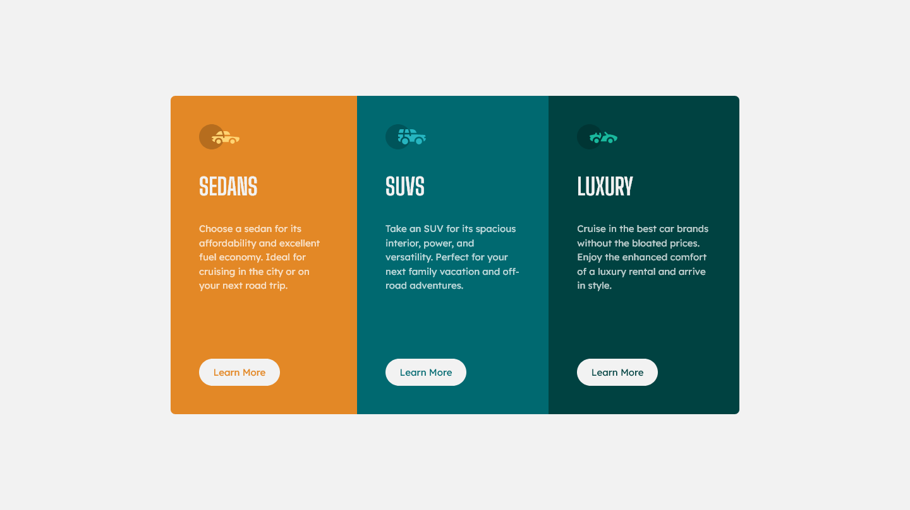

# Frontend Mentor - 3-column preview card component

A responsive 3-column vehicle-class card with CTAs built using HTML and Sass for a [Frontend Mentor](https://www.frontendmentor.io) coding challenge.

Live site: https://alimansoor-create.github.io/3-column-preview-card-component-main/

Here's the goal:

And here's what I made:

Any and all feedback is appreciated!
