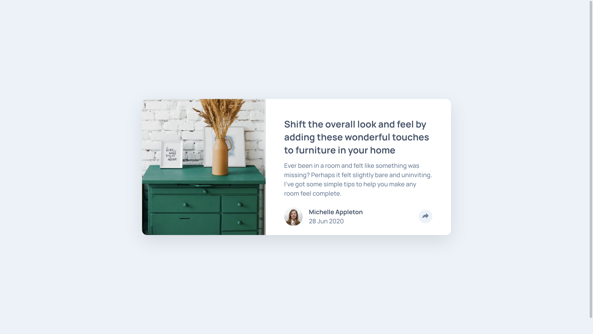

# Frontend Mentor - Article preview component

An article card component built using HTML, Sass, and some Javascript to show a popup dialog, for a [Frontend Mentor](https://www.frontendmentor.io) coding challenge  
Live site: https://alimansoor-create.github.io/frontend-mentor/article-preview-component-master/

Here is the goal

And here is what I made:

I had some trouble getting the picture, and the rest of the card to resize to a 2:3 ratio. In the end, I gave the picture a hard-coded width. Please let me know if I could have achieved a ratio some way.

Any and all feedback would be appreciated!
