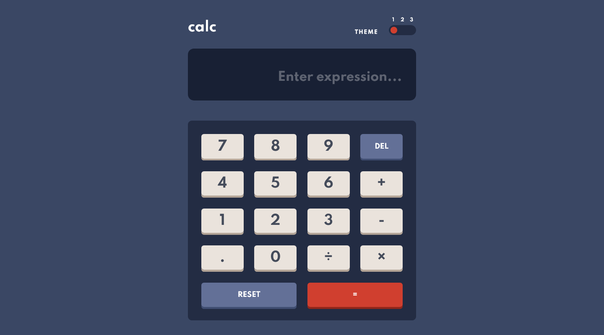

# Calculator App

## Welcome!

This is a simple calculator built with ReactJS, as part of a coding challenge on [Frontend Mentor](https://www.frontendmentor.io/)

## Features

- Responsive to mobile and desktop sizes
- Ability to switch between 3 different themes
- Retains last picked theme
- Keyboard can be used to operate on computers
- Can be installed as an app on mobile devices
- Supports decimal calculation

## Tech Stack

- ReactJS
- styled-components

## Links

- Live demo: https://alimansoor-create.github.io/frontend-mentor/calculator-app/
- Github repo: https://github.com/alimansoor-create/frontend-mentor/tree/master/calculator-app

## Screenshots

## Developed by

Syed Ali Mansoor

- Github - [@alimansoor-create](https://github.com/alimansoor-create)
- Instagram - [@\_\_ali.mansoor](https://www.instagram.com/__ali.mansoor/)
