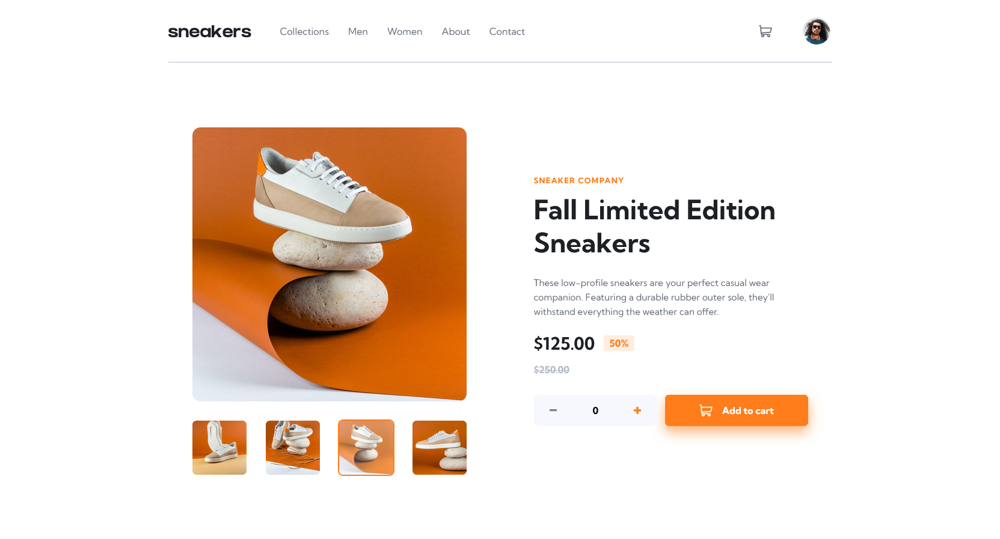
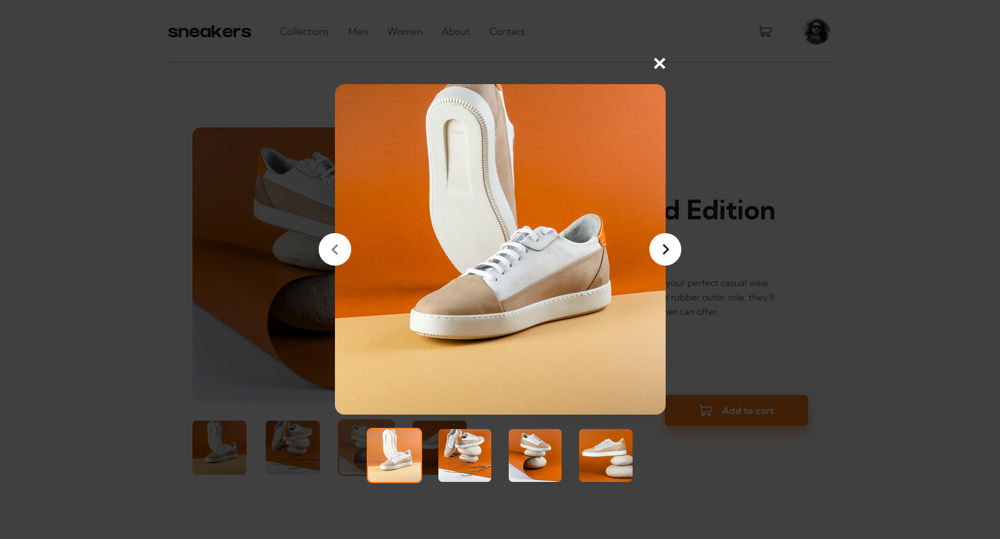
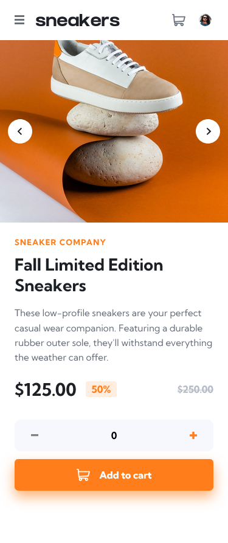

# Frontend Mentor - E-commerce product page

## Welcome! 👋

This is an e-commerce website built with React and Sass for a coding challenge on [Frontend Mentor](https://www.frontendmentor.io). It was my second project with React and I gotta say, I'm _hook_-ed! 😆

You could say I have fallen in love with the React mindset—think of every problem as a collection of smaller problems and crack each one of them individually. When all the individual pieces of your app come together and coalesce into what you were trying to accomplish, a heavy sigh of relief escapes the mouth and a major part of the next few hours is spent just clicking buttons, tabbing through the experience, and getting delighted at every micro-interaction, even though you have seen it an umpteen times before.

Yet, there is always more to explore and I look forward to tinkering with all the possibilities that have opened up to me as a React developer now.

My first step will probably be to dive into CSS-in-JS, or [styled-components](https://styled-components.com/) and [Emotion](https://emotion.sh), to be more exact.

After that, I will hopefully explore the mysterious world that is the server side. I know that there is [Next.js](https://nextjs.org/) and [Gatsby](https://www.gatsbyjs.com/) for doing all that stuff but I am still kinda unaware of how everything works. Welp, that's what I plan to learn!

I also have eyes on the [Intersection Observer API](https://developer.mozilla.org/en-US/docs/Web/API/Intersection_Observer_API) and [GSAP](https://greensock.com/gsap/) for animations and scroll effects.

Once I master the art of animation (or atleast become somewhat proficient at it), I will enter the 3-dimensional realm and make some cool stuff with [ThreeJS](https://threejs.org/).

Do you think there is anything else I could learn? Do let me know! And of course, feedback on the solution will be highly appreciated!

## Screenshots

