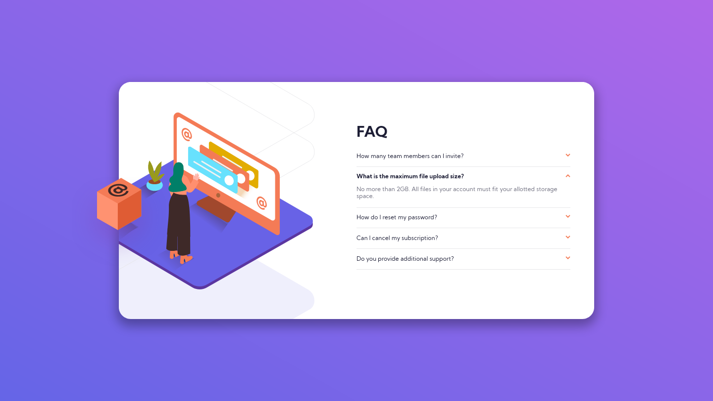

# Frontend Mentor - FAQ accordion card

An FAQ accordion card for a [Frontend Mentor](https://www.frontendmentor.io) coding challenge, built using HTML, SCSS, and JS.

Here is the goal:

And here's what I made:

