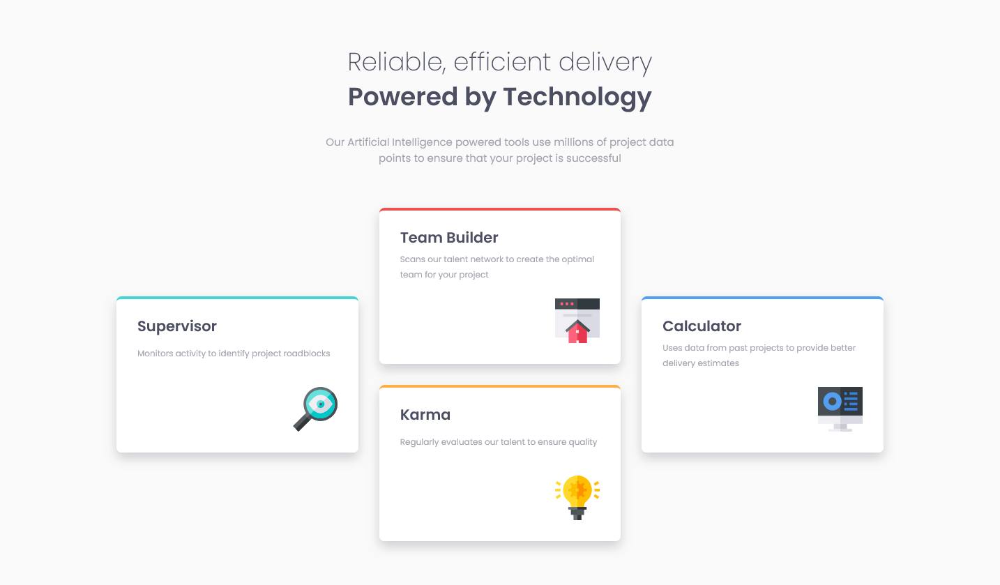

# Frontend Mentor - Four card feature section

A responsive card section built using Sass and Grid, for a [Frontend Mentor](https://www.frontendmentor.io) coding challenge. Layouts for mobile, tablet, and desktop present.

Live site: https://alimansoor-create.github.io/frontend-mentor/four-card-feature-section-master

Here's the goal:

And here's what I made:

Please leave some feedback!
