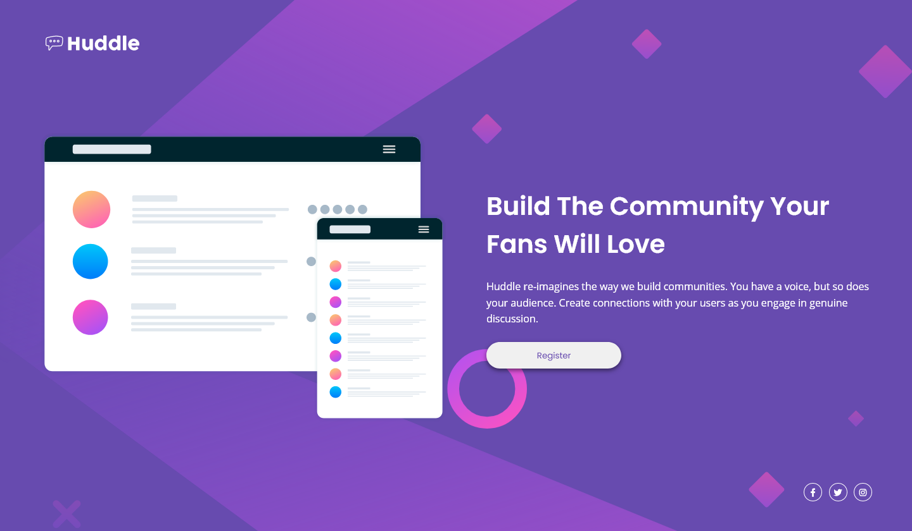

# Frontend Mentor - Huddle landing page with single introductory section

A responsive landing page for an app, "Huddle" built using Sass, for a [Frontend Mentor](https://www.frontendmentor.io) coding challenge.

Live site: https://alimansoor-create.github.io/frontend-mentor/huddle-landing-page-with-single-introductory-section-master

Here's the goal:

And here's what I made:

Please leave some feedback!
