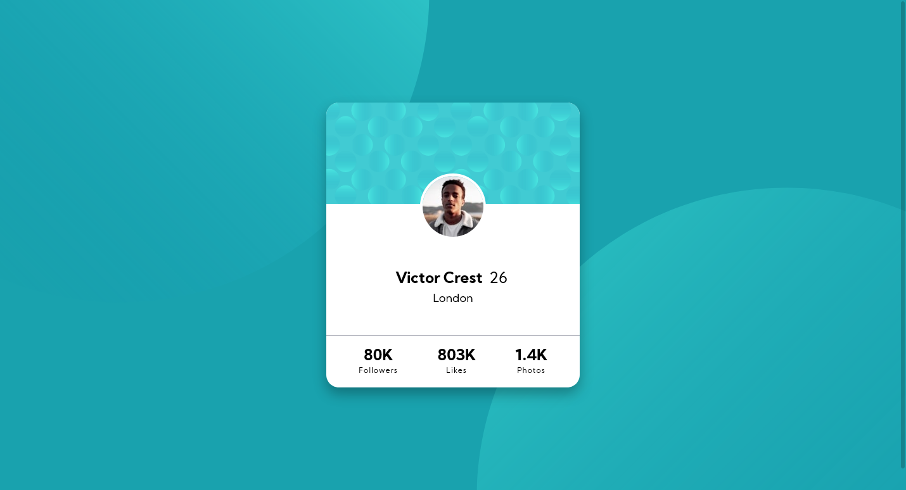

# Frontend Mentor - Profile card component solution

This is my first Frontend Mentor challenge! I am really satisfied with what I was able to make, plus it's responsive!

I had some trouble moving the profile picture and have it overlap with the background but I used `transform: translateY()` and was thus able to achieve this.

Live site: https://alimansoor-create.github.io/frontend-mentor/profile-card-component-challenge

Here's the original goal:

And here's what I made:

Please do leave your feedback!
