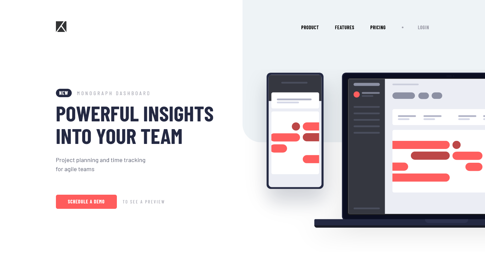

# Frontend Mentor - Project tracking intro component solution

Hello! 👋

This is a solution to the [Project tracking intro component challenge on Frontend Mentor](https://www.frontendmentor.io/challenges/project-tracking-intro-component-5d289097500fcb331a67d80e). Frontend Mentor challenges help you improve your coding skills by building realistic projects.

## Table of contents

- [Overview](#overview)
  - [The challenge](#the-challenge)
  - [Screenshot](#screenshot)
  - [Links](#links)
- [My process](#my-process)
  - [Built with](#built-with)
  - [What I learned](#what-i-learned)
- [Author](#author)

## Overview

### The challenge

Users should be able to:

- View the optimal layout for the site depending on their device's screen size
- See hover states for all interactive elements on the page
- Create the background shape using code

### Screenshot

### Links

- Live Site URL: [Github Pages](https://alimansoor-create.github.io/frontend-mentor/project-tracking-intro-component)

## My process

### Built with

- Semantic HTML5 markup
- Flexbox
- Mobile-first workflow

### What I learned

This challenge taught me how to make a collapsible navbar for mobile devices, and was also good practice for a 2-column layout.

## Author

**Syed Ali Mansoor**

- Instagram - [@design.alimansoor](https://www.instagram.com/design.alimansoor)
- Frontend Mentor - [@alimansoor-create](https://www.frontendmentor.io/profile/alimansoor-create)
