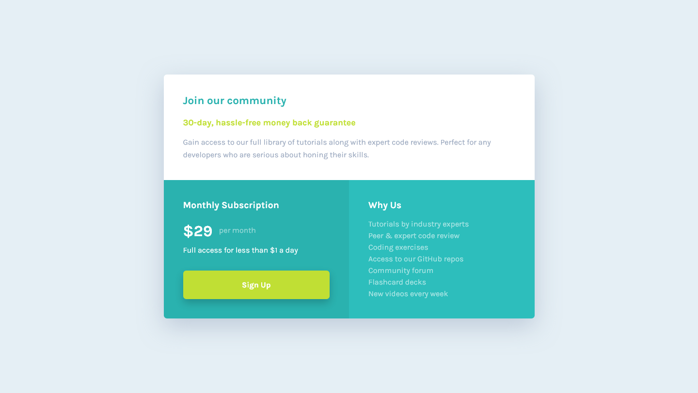

# Frontend Mentor - Single price grid component

A responsive price component built using Grid with Sass for a [Frontend Mentor](https://www.frontendmentor.io) coding challenge.

Live site: https://alimansoor-create.github.io/frontend-mentor/single-price-grid-component-master

Here's the goal:

And here's what I made:

