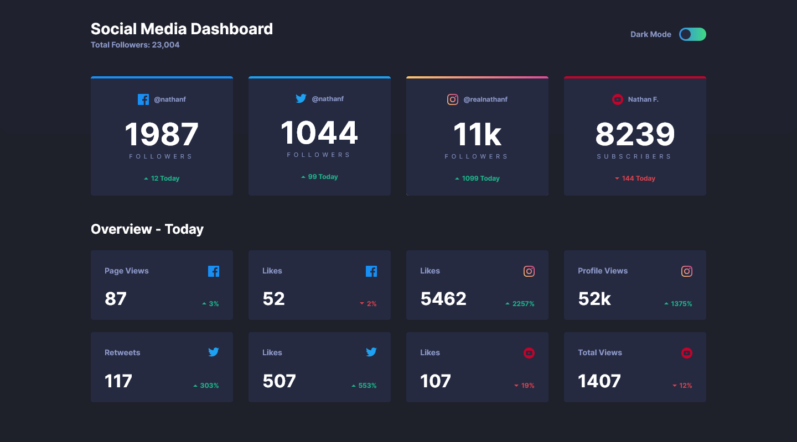

# Frontend Mentor - Social media dashboard with theme switcher solution

Hello! 👋

This is a solution to the [Social media dashboard with theme switcher challenge on Frontend Mentor](https://www.frontendmentor.io/challenges/social-media-dashboard-with-theme-switcher-6oY8ozp_H). Frontend Mentor challenges help you improve your coding skills by building realistic projects.

## Table of contents

- [Overview](#overview)
  - [The challenge](#the-challenge)
  - [Screenshot](#screenshot)
  - [Links](#links)
- [My process](#my-process)
  - [Built with](#built-with)
  - [What I learned](#what-i-learned)
  - [Continued development](#continued-development)
  - [Useful resources](#useful-resources)
- [Author](#author)

## Overview

### The challenge

Users should be able to:

- View the optimal layout for the site depending on their device's screen size
- See hover states for all interactive elements on the page
- Toggle color theme to their preference

### Screenshot



### Links

- Solution URL: [Solution on Frontend Mentor](#)
- Live Site URL: [Github Pages](https://alimansoor-create.github.io/frontend-mentor/social-media-dashboard-with-theme-switcher)

## My process

### Built with

- Semantic HTML5 markup
- CSS custom properties
- localStorage access
- Sortable.js
- Flexbox
- CSS Grid
- Mobile-first workflow

### What I learned

#### **Theming using CSS Custom Variables**

This challenge taught me a great way to implement dark/night modes into websites without much hassle, using CSS custom properties. You first declare the colors for the default mode in the `:root` selector and the switchable mode in a class selector that is applied to the body.

```css
/* Dark mode */
:root {
  --text-color: white;
  --bg-color: darkgray;
}

/* Light mode */
.light-mode {
  --text-color: black;
  --bg-color: white;
}
```

You use the custom variables to apply styles to all elements in the body:

```css
.card {
  color: var(--text-color);
  background-color: var(--bg-color);
}
```

Then using JavaScript, you apply the .light-mode class to the body element when the toggle is switched.

```js
if (toggle.checked) {
  document.body.classList.add("light-mode");
} else {
  document.body.classList.remove("light-mode");
}
// No need to update each elements' styles!
```

#### **Reorderable groups of elements using Sortable.js**

Using Sortable.js, you can create a group of elements that can be dragged and reordered by the mouse. Suppose you have the following HTML structure.

```html
<!-- Sortable.js -->
<script src="https://raw.githack.com/SortableJS/Sortable/master/Sortable.js"></script>

<!-- Structure -->
<div class="parent">
  <div></div>
  <div></div>
  <div></div>
</div>
```

You can then use the following Javascript commands to make this group reorderable.

```js
const parent = document.querySelector(".parent");
const parentSortable = Sortable.create(parent);
```

Simple!

#### **localStorage access**

By using the localStorage, you can store user preferences to the browser's memory and can then load them on request. Data is stored in the localStorage in key-value pairs.

The following syntax is used to work with data in the localStorage

```js
// Store data
window.localStorage.setItem(key, value);
// Get data
window.localStorage.getItem(key, value);
```

### Continued development

I wish to learn more about other useful Javascript libraries and how they can be utilized to easily create interactive components.

I also aim to learn more about the local storage and its possibilities.

### Useful resources

- [MDN Window.localStorage reference](https://developer.mozilla.org/en-US/docs/Web/API/Window/localStorage)
- [Sortable.js on Github](https://github.com/SortableJS/Sortable)
- [Theming using CSS Custom Properties - DigitalOcean](https://www.digitalocean.com/community/tutorials/css-theming-custom-properties)

## Author

**Syed Ali Mansoor**

- Instagram - [@design.alimansoor](https://www.instagram.com/design.alimansoor)
- Frontend Mentor - [@alimansoor-create](https://www.frontendmentor.io/profile/alimansoor-create)
