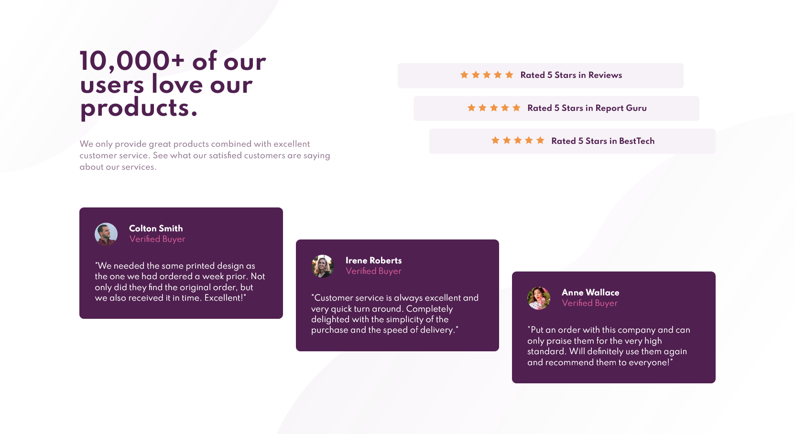

# Frontend Mentor - Social proof section

Here's a social proof webpage I built for a Frontend Mentor coding challenge. I used pure HTML and CSS for this.
It's also responsive.

Live site: https://alimansoor-create.github.io/frontend-mentor/social-proof-section-master

Here's the original goal:

And here's what I made:

Hope you like it!
