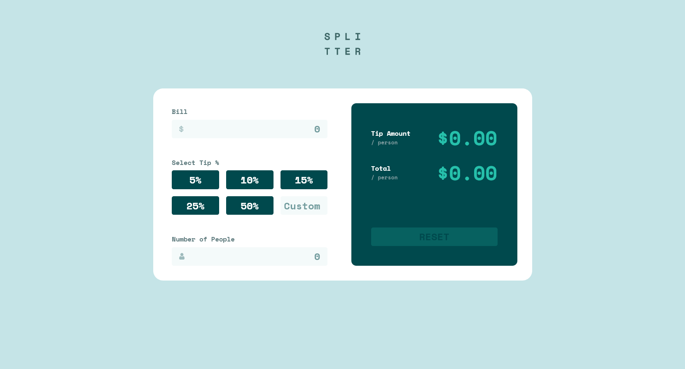
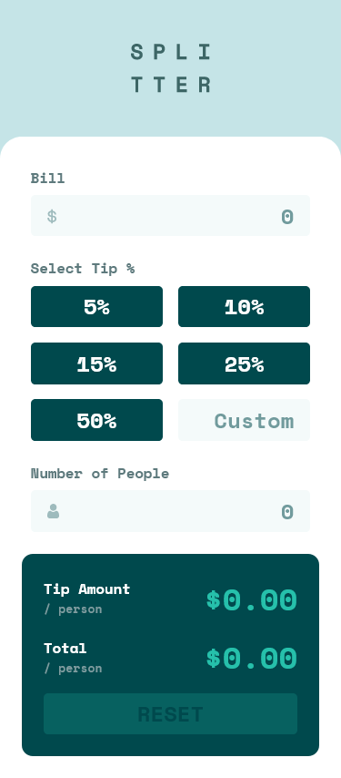

# Frontend Mentor - Tip calculator app solution

This is a solution to the [Tip calculator app challenge on Frontend Mentor](https://www.frontendmentor.io/challenges/tip-calculator-app-ugJNGbJUX). Frontend Mentor challenges help you improve your coding skills by building realistic projects.

## Table of contents

- [Overview](#overview)
  - [The challenge](#the-challenge)
  - [Screenshots](#screenshots)
  - [Links](#links)
- [My process](#my-process)
  - [Built with](#built-with)
  - [What I learned](#what-i-learned)
  - [Continued development](#continued-development)
- [Author](#author)

## Overview

### The challenge

Users should be able to:

- View the optimal layout for the app depending on their device's screen size
- See hover states for all interactive elements on the page
- Calculate the correct tip and total cost of the bill per person

### Screenshots

### Links

- [Solution](#)
- [Live Site](https://alimansoor-create.github.io/frontend-mentor/tip-calculator-app)

## My process

### Built with

- [Create React App](https://create-react-app.dev)
- [React](https://reactjs.org/) - Class-based components
- Semantic HTML5 markup
- Flexbox
- CSS Grid
- Mobile-first workflow

### What I learned

This was my first project with React and I am really intrigued by the power of this library/framework. The usage of components has helped me a lot in simplifying my workflow, and the fact that all form data is stored in state makes calculations from the data a breeze. I also love how components can be reused and I have tried my best to make ones that can be reused properly.

#### App structure

- Calculator - Base component; stores form input data in state
  - CalculatorForm - Stateless; renders a form which collects data and passes it to _\<Calculator>_
    - Input - Stateless; renders a label, an input element, and conditional error message
    - Selector - Renders a list of _\<Option>s_ and a _\<CustomOption>_
      - Option x 5 - Stateless; renders a radio button styled to look like a normal button
      - CustomOption - Stateless; renders an input element
    - Input
  - CalculatorOutput - Renders the calculation results and a button to reset the form
    - Output x 2 - Stateless; renders a label and a calculated figure

#### Features

- Form input values are stored in the base _\<Calculator>_ component. This is updated every time an input is changed. All inputs are controlled by React.
- On change, the _\<Calculator>_ component calculates figures for tip amount/person and total/person, and passes these to the _\<CalculatorOutput>_ component.
- The _\<Selector>_ component includes a text input along with the radio buttons. When this input is focused on, `state.isEditing` changes to `true` and the radio buttons are prevented from being selected as the user types in the percentage.
- When the same input is blurred, if the user types in a value already present among the radio options, the respective radio button is selected and the text input is cleared.
- If the user enters a negative number in any of the two _\<Input>_ components, an error message appears in red.
- NaN and Infinity errors are handled, and default to output values of $0.00.
- The app is responsive even to the narrowest of screens. (260px, to be specific)

### Continued development

I made this project using class-based components, and I want to do my next one with functional components and hooks, so I aim to learn more about those next up.

## Author

**Syed Ali Mansoor**

- Instagram - [@design.alimansoor](https://www.instagram.com/design.alimansoor)
- Frontend Mentor - [@alimansoor-create](https://www.frontendmentor.io/profile/alimansoor-create)
